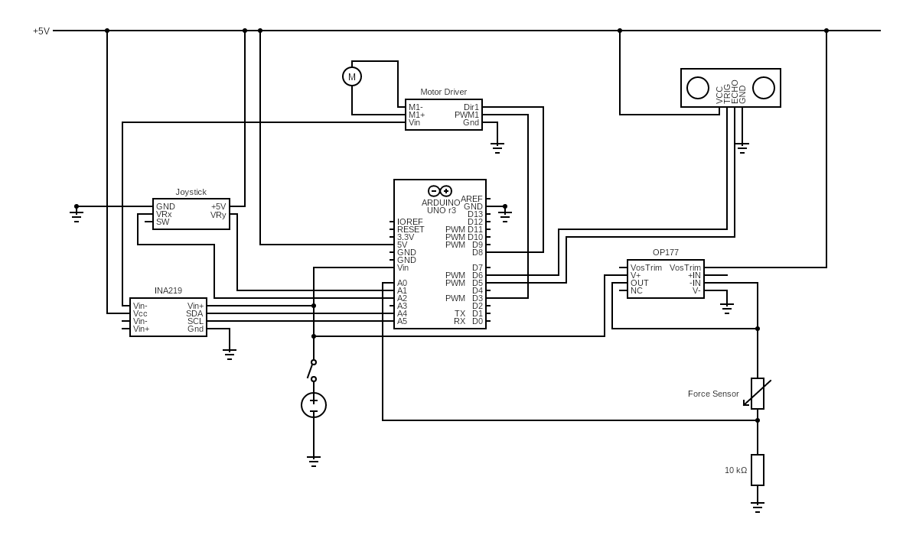

# Robot Gripper Arm Project
[](https://www.arduino.cc/en/hardware/uno)
[](LICENSE)
[](https://warwick.ac.uk/)
[](https://github.com/topics/education)
[](https://en.wikipedia.org/wiki/Robotics)

## Overview

An electromechanical gripper arm prototype designed to assist individuals with limited mobility in performing daily tasks. The device features autonomous and adaptive gripping capabilities using force and distance feedback, with an intuitive joystick interface and built-in safety mechanisms.

### Key Applications
- Assistive technology for individuals with mobility impairments
- Educational robotics and mechatronics demonstrations
- Research platform for adaptive gripping algorithms

## Features

- 🤖 **Autonomous Grip Control** — Intelligent gripping using force and distance sensor feedback
- 🎯 **Ergonomic Design** — Bike-handle grip design optimised for accessibility
- ⚙️ **PID Control System** — Consistent grip strength regulation for delicate objects
- 🕹️ **Intuitive Interface** — Joystick control for precise positioning and operation
- 🛡️ **Safety Mechanisms** — Emergency release and force limiting protection
- 📊 **Real-time Feedback** — Continuous monitoring of grip force and object detection

## Technical Specifications

### Hardware Components
- **Microcontroller:** Arduino Uno R3
- **Power Supply:** 12V, 1A (12W) plug-in adapter
- **Weight Capacity:** 10g – 500g
- **Object Dimensions:** 15×10×10mm – 60×80×150mm

### Sensors & Actuators
| Component | Model | Purpose |
|-----------|--------|---------|
| **Current Sensor** | INA219 | Motor current monitoring and force feedback |
| **Distance Sensor** | HC-SR04 Ultrasonic | Object detection and positioning |
| **Force Sensor** | Force Sensing Resistor (FSR) | Direct grip pressure measurement |
| **Drive Motor** | DC Geared Motor | Primary gripping mechanism |
| **Positioning Motor** | Servo Motor | Gripper rotation and alignment |

### Control System
- **Algorithm:** PID feedback control
- **Response Time:** <100ms sensor-to-actuator
- **Precision:** ±2mm positioning accuracy
- **Safety Limits:** Configurable force thresholds

### Circuit Diagram



The circuit diagram shows the complete electrical connections between the Arduino Uno, sensors, motors, and power supply.

## Quick Start

### Prerequisites
- **PlatformIO IDE** (or PlatformIO Core CLI)
- **USB Cable** (Type A to Type B)
- **12V Power Supply**

### Installation

1. **Clone the Repository**
   ```bash
   git clone https://github.com/AdzCoder/robot-gripper-arm.git
   cd robot-gripper-arm
   ```

2. **Install Required Libraries**
   
   This project uses PlatformIO for dependency management. Libraries are automatically installed from `platformio.ini`:
   
   ```ini
   lib_deps = 
      adafruit/Adafruit INA219@^1.2.3
      jchristensen/movingAvg@^2.3.1
      arduino-libraries/Servo@^1.2.1
   ```
   
   | Library | Version | Licence | Purpose |
   |---------|---------|---------|---------|
   | [Adafruit INA219](https://github.com/adafruit/Adafruit_INA219) | ^1.2.3 | MIT | Current sensing and power monitoring |
   | [movingAvg](https://github.com/JChristensen/movingAvg) | ^2.3.1 | GPL-3.0 | Signal filtering and noise reduction |
   | [Servo](https://github.com/arduino-libraries/Servo) | ^1.2.1 | LGPL-2.1 | Servo motor control |

3. **Build and Upload**
   ```bash
   # Build the project
   pio run
   
   # Upload to Arduino Uno
   pio run --target upload
   ```

### Hardware Setup

1. **Connect Power Supply** — Ensure 12V adapter is properly connected
2. **Verify Connections** — Check all sensor and motor wiring per circuit diagram
3. **Calibrate Sensors** — Run initial calibration routine (see User Manual)

## Usage Guide

### Basic Operation
1. **Power On** — Switch on main power and wait for initialisation LED
2. **Position Gripper** — Use joystick X/Y axes for precise positioning
3. **Activate Grip** — Press joystick button to engage autonomous gripping
4. **Release Object** — Push joystick forward for controlled release

### Advanced Features
- **Force Adjustment** — Modify grip strength via potentiometer
- **Emergency Stop** — Pull joystick backwards for immediate release
- **Calibration Mode** — Hold button during startup for sensor recalibration

### Troubleshooting
- **No Response:** Check power connections and Arduino USB link
- **Weak Grip:** Verify motor current readings and force sensor calibration
- **Positioning Issues:** Recalibrate distance sensor and check for obstructions

## Documentation

- ⚡ **[Circuit Diagram](docs/RobotHandCircuit.png)** — Electrical connection schematic
- 📊 **[PID Data](data/PID_data.csv)** — PID control system test data
- 📈 **[Current Filter Data](data/current_filter_data.csv)** — Signal filtering analysis data

## Project Information

**Development Team:** Group J4  
**Institution:** University of Warwick, School of Engineering  
**Module:** [ES2C6: Electromechanical System Design (2023/24)](https://courses.warwick.ac.uk/modules/2023/ES2C6-15)

**Project Objectives:**
- Design and implement an assistive robotic device
- Integrate multiple sensor systems for autonomous operation
- Develop safety-critical control algorithms
- Create accessible human-machine interfaces

## Future Enhancements

Potential improvements identified during development:
- **Machine Learning Integration** — Adaptive grip patterns based on object recognition
- **Wireless Control** — Bluetooth or Wi-Fi interface for remote operation
- **Multi-DOF Movement** — Additional servo motors for enhanced positioning
- **Visual Feedback** — Camera integration for improved object detection

## Contributing

This is an educational project that has been completed. However, if you're using this code for your own research or studies:

1. Fork the repository for your modifications  
2. Document any significant changes or improvements
3. Consider sharing results with the academic community
4. Respect the original licensing terms

## Project Status

**Status:** Completed (Academic Year 2023/24)  
**Maintenance:** No longer actively maintained  
**Usage:** Available for educational and research purposes

This project represents a successful completion of the ES2C6 coursework requirements and demonstrates practical application of mechatronic principles in assistive technology.

## Licence

MIT Licence — see the [LICENCE](LICENSE) file for details.

---

*Developed by Adil Wahab Bhatti as part of academic coursework at the University of Warwick.*